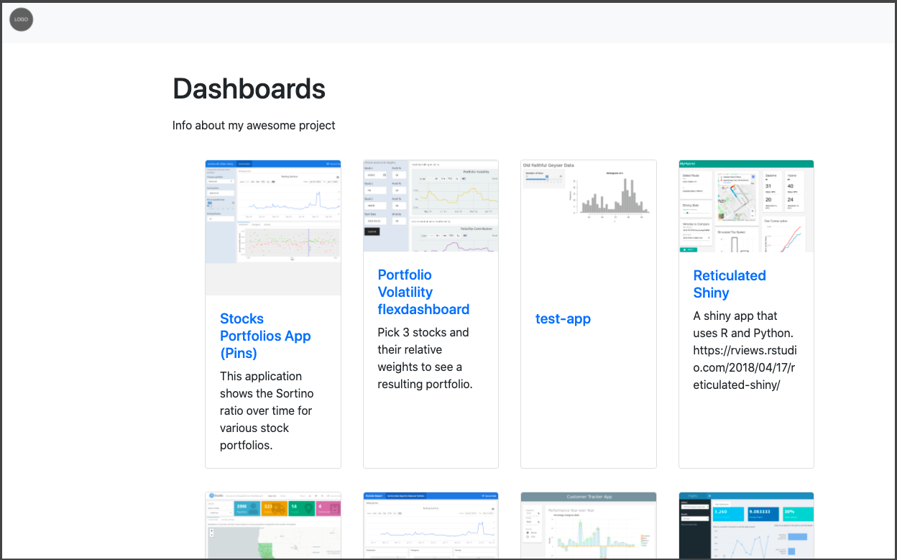

## rscpages-proto

Example [project page](https://colorado.rstudio.com/rsc/dashboards/) produced by this exploratory code:




This repository shows an example of an additional page creation workflow for RStudio Connect. The code in this repository is not yet structured as a package, it is more a set of exploratory functions.

To get started, take a look at the `page-generator.Rmd` example. You will need the following packages:

```
remotes::install_github('rstudio/connectapi')
remotes::install_github('rstudio/bslib')
remotes::install_github('rstudio/rmarkdown')
```

You will also need to create a .Renviron file that contains:

```
CONNECT_SERVER  = "https://colorado.rstudio.com/rsc"
CONNECT_API_KEY = "<YOUR API KEY>"
```

From there, simply render `page-generator.Rmd`.

The heavy lifting function here is `rsc_tiles` which relies on boostrap v4 components, brought into the html page using `rsc_project_page`. This implementation relies on the `connectapi` package for fetching data. The functions inline a lot of HTML which is not something I would expect most R users to do.

A few goals showcased in the `page-generator.Rmd`:

- The example takes advantage of the connectapi package's ability to eagerly filter content *before* querying the API (e.g. filtering by tag)

- The example takes advantage of content images, descriptions, and titles from Connect 

- The example's tile component creates a "gallery", which is what many users might expect after using Google Drive, Tableau, and Qlick which present content as cards.

- A main limitation of the current approach is search. I would recommend the gallery approach for projects with less than 20 content items.

This example project is a PoC. There are a few significant areas I could imagine exploring further:

- Adding and incorporating tests and validation for the functions.
- Making it easier to style the results. I am confused by how bslib and rmarkdown play together.
- Tweak the styles to account for different image sizes, non-complete rows of cards, and really long descriptions.

